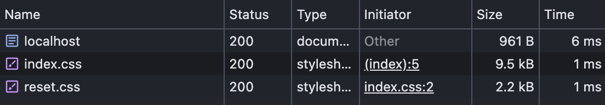

## Building a zero-dependency blog with Typescript, Markdown, and CSS

Faced with the prospect of creating a new blog, I decided to build one from
scratch.

I hacked around for a day and this is what I came up with.

For context, I've spent a _lot_ of time with React, Next.js, and Gatsby. I
wanted the ergonomics of a modern JAMStack framework (dev server, markdown
content, SSG), but without shipping a whole copy of React to the client.

Here are the different approaches I've used in the past:

-   **Custom CMS in PHP**: Great for control, but over-engineered and a pain to
    maintain.
-   **[Gatsby](https://github.com/gatsbyjs/gatsby)**: Great for SSG from
    markdown, but a lot of JS to ship to the client.
-   **[Next.js](https://github.com/vercel/next.js)**: In many ways the framework
    I wished Gatsby was. But still a lot of JS to ship.

For fun, and a challenge, I decided to build a zero-dependency blog using
Typescript, Markdown, and plain-ole HTML & CSS. Orchestrating builds with a
simple Node script, and using Remark/Rehype to pre-process the Markdown. It
ended up being a nostalgic throwback to the days of task runners like Gulp and
Grunt.

And in the end: look ma — no JS. 😎

That's not to say that there's no JS involved at all, I ended up cobbling
together a few NPM packages to help with the Markdown processing and the dev
server. At the time of writing, the stack is:

| Package(s)                                 | Description                                                                                                                                                                                                                                                                                                                                                                                                                                              |
| :----------------------------------------- | :------------------------------------------------------------------------------------------------------------------------------------------------------------------------------------------------------------------------------------------------------------------------------------------------------------------------------------------------------------------------------------------------------------------------------------------------------- |
| `node` `tsx`                               | The build process is run from a single ~150 line NodeJS script, mainly making use of th`fs` and `path` modules to pipe files from `src` to `dist` with light modifications, and to transform markdown into HTML. I use [`tsx`](https://github.com/privatenumber/tsx) to run node scripts written in TS, with transpilation done on-the-fly.                                                                                                              |
| `handlebars`                               | I use [`handlebars`](https://github.com/handlebars-lang/handlebars.js/) as a templating engine to inject re-usable partials into the HTML, e.g. nav bar, document head.                                                                                                                                                                                                                                                                                  |
| `unified` `remark` `rehype` `highlight.js` | The build script uses a [`unified`](https://github.com/unifiedjs/unified) pipeline for parsing markdown with [`remark`](https://github.com/remarkjs/remark) and transforming it into HTML with [`rehype`](https://github.com/rehypejs/rehype), with some plugins to inject additional html (e.g. nav bar) and do syntax highlighting with [`highlight.js`](https://github.com/highlightjs/highlight.js), which is then inserted as a handlebars partial. |
| `nodemon` `http-server` `concurrently`     | Roll-your-own dev server. [`nodemon`](https://github.com/remy/nodemon) watches for file changes and re-runs the build process. [`http-server`](https://github.com/http-party/http-server) serves the html during local development, and this is all orchestrated with[ `concurrently`](https://github.com/open-cli-tools/concurrently) to wrap running multiple processes.                                                                               |

And that's it! Thanks for reading.