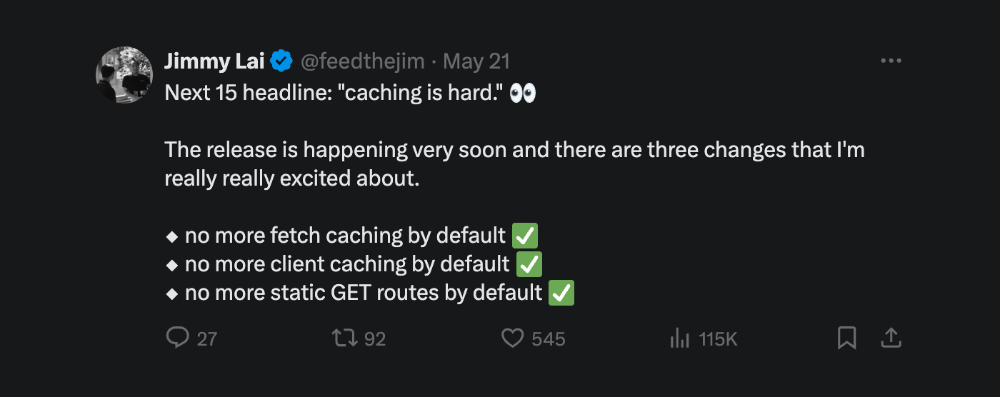
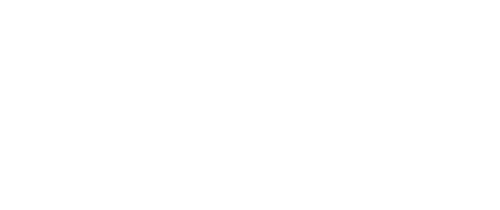
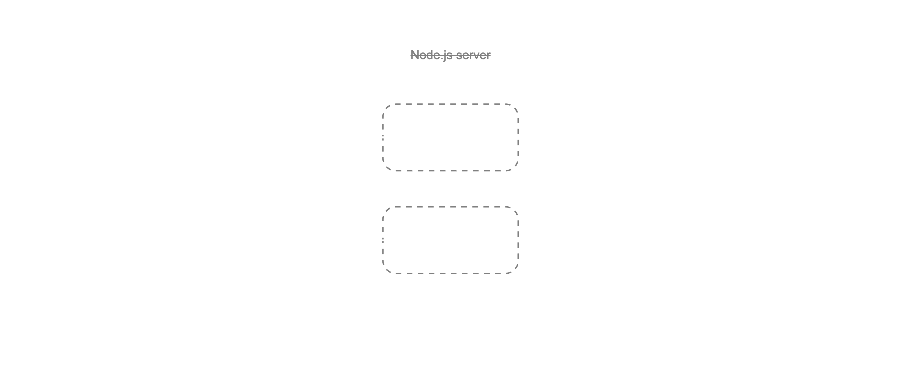
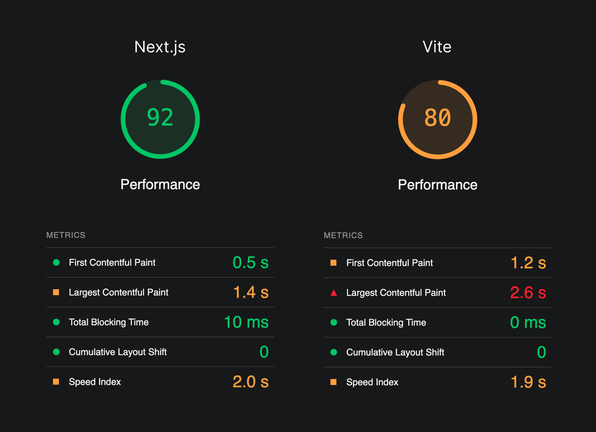

## This post is about my experience using Next.js for a large-scale online banking portal, and why we eventually decided to move away from it to a pure client-side rendered React app built with Vite.

### TL;DR
- We built an online banking portal using Next.js, which seemed great at first.
- The app was slow, as SSR isn't really suited to a dynamic dashboard application.
- The caching model is hard to reason about, leading to bugs and slowing us down.
- We migrated to a client-side React app, and saw night-and-day improvements.

---

## The background

I joined [Fuse](https://fuse.me) in April 2023 as a senior frontend engineer. At the time, they were just kicking off development on their first product, a banking as a service (BaaS) platform that would power payments in the Middle East.

My role was to build the online banking portal, which would allow customers to:
- Manage and accounts and transactions
- Send and receive money
- Manage their API integration and organization settings
- Do reporting and produce statements

This was a complete greenfield project, with the backend and frontend to be developed in tandem. The backend was being built with Rust, axum and Postgres, and the frontend tech stack was up to me to decide.

The initial build-out was quick, and by the end of 2023, we had a fully functional portal that was being used by a small group of internal testers. It began to be used by a few early customers in early 2024 and has since gone into "maintenance mode" as we focus on entering new markets and adding new currencies.

<figure>
    <video src="../assets/2024-06-03-why-we-stopped-using-next-js-portal-screens.mp4" muted autoplay loop playsinline preload="auto" disablePictureInPicture></video>
    <figcaption>The Fuse portal, as of June 2024. &copy; Fuse Financial Technologies Inc.</figcaption>
</figure>

---

### Why I chose Next.js

In April 2023, when we kicked off, Next.js was _very much_ in vogue. It was the go-to framework for React developers, and for good reason — Next.js <=13.x.x was a great framework for building React applications with **some** server-side functionality, the server/client divide was clear (`getServerSideProps`, `getStaticProps`, etc.), and it had a great developer experience and documentation.

I had worked with it already, trusted it, and could use it to get up and running and start delivering value quickly, so that's what we went with.

### Next.js 14 and the App Router

In late 2023, Next.js 14 was released, and with it came the [App Router](https://nextjs.org/docs/app). 

This App Router leverages React Server Components (RSC) as the default way to build pages. RSC is a very cool and useful piece of technology _for certain use cases_, and I was excited to use it. Though it was a bit of a mental model shift.

Luckily Next.js supported incremental adoption of the App Router, wo we could test it out on a few isolated features, and if it worked out well, we could roll it out to the rest of the app in time. 

And we did like it — _at first_ (more on this later) — RSCs made certain parts of the code more straightforward — fetching your data in an async component and using suspense to show a fallback UI felt nice. Navigation also _felt_ more responsive, comparatively, than when we were using `getServerSideProps`, mainly because of the in-built [loading UI](https://nextjs.org/docs/app/building-your-application/routing/loading-ui-and-streaming).

---

### My perceived problem(s) with Next.js

Building out a product over the course of a year, you get to know the ins and outs of the technology you're using. And while Next.js is a great framework for many use cases, we began to see some recurring issues that led us to believe it wasn't right for _our_ use case.

#### 1. Caching

> "There are only two hard things in Computer Science: cache invalidation and naming things"

This quote, often attributed to [Phil Karlton](https://www.karlton.org/karlton/), still holds up. Caching, and more specifically, cache _invalidation_, is a hard thing to get right, and Next.js 14's opinionated approach to caching only makes it worse.

Caching is done at [several levels](https://nextjs.org/docs/app/building-your-application/caching#overview) in Next.js 14, (spread across the client & server), and dialling in cache-control is not straightforward. In some cases, you lean on directives at the page component level, in some cases, you pass it as options to `fetch`. The API is fragmented and requires a lot of reading to understand how it all fits together. And most significantly, it's opt-out, not opt-in.

Cache invalidation is also hard to reason about, as the methods available for manual invalidation can only be called from the server, which then in-turn invalidates the client-side cache. Couple this with an already complex problem — _when_ to invalidate the cache in a highly dynamic dashboard-style application — and you end up with a large surface area for edge case and corner case bugs.

The [documentation](https://nextjs.org/docs/app/building-your-application/caching) on caching is extremely verbose (🚩), and has multiple complex diagrams and tables (🚩), which — to me — is a sign that their implementation is a bit overcooked.

Even [Jimmy Lai](https://x.com/feedthejim), engineering manager on the Next.js team, [admits](https://x.com/feedthejim/status/1792969159321723244) that they didn't get caching right in Next.js 14.

<figure>
    </img>
    <figcaption><a href="https://x.com/feedthejim/status/1792969159321723244">Twitter post from Jimmy Lai teasing Next.js 15.</a> (RC at time of writing.)</figcaption>
</figure>

Now, I know what you're thinking — **"that sounds like a skill issue to me, bro"** — and you what? You may be right. Maybe...

With enough investment in learning and understanding, and setting conventions that work for **your application**, you can dial this behavior in. But in the year we spent building and operating this product, we found that caching in Next.js was sufficiently hard to reason about that it posed a significant impediment to the team's ability to get stuff done, and craft a bug-free user experience. Especially for our more junior team members.

We had multiple issues where users would see stale data, or the wrong data, and re-upload a batch of payments, or reach out for support because it _appeared_ that the app was not working as expected (which means it _wasn't_ working as expected). These were real issues for our users, with a real impact on the trust they had in our product.

#### 2. Performance

Our issues with performance were specific to our environment, and the way we were using Next.js, but significant enough to contribute to the reasons we chose to do a re-write. To sum it up in a few words: **our app was dog slow**.

First, it's important to spell out the constraints we were working under:
- **Highly dynamic data**: Our application was essentially a dashboard. Actions performed in the dashboard (e.g. initiating a payment) have an impact on other resources (e.g. the account balance) so where possible, we opted out of caching or had very short cache lifetimes.
- **Hosted in the Middle East**: For compliance reasons, our data had to be stored in the Middle East. For simplicity our applications were as well. Our users however could be in Europe, India, or anywhere, really. This meant they were often geographically far from our servers, and we had to deal with high latency on network requests.
- **Everything went though the backend**: We had a very strict separation of concerns, and the frontend was designed to be essentially a dumb client that fetched or posted data to/from the backend.

Our performance issues stemmed entirely from our architectural decisions — __*my*__ architectural decisions, in fact — and not a fault of Next.js. But Next.js did not help us solve these issues, and in some cases, made them worse.

For loading up a typical page, the journey looked something like this:

</img>

Which is a lot of overhead. This seems obvious in hindsight, but at the time, we were so focused on getting the product out the door that we didn't stop to think about the performance implications of our decisions.

The backend, written in Rust, was _**fast**_, even when fetching 1000s of records, but the network latency on the roundtrip across hundreds of kilometers of fibre optic cable negated all of that speed.

#### 3. Reasoning about the client-server divide was difficult for some

Now — let me be clear — I like the RSC workflow. I think that components owning their own data fetching is a powerful feature. The ability to make authenticated requests, or directly interact with a DB at the component level is freeing. And the negation of the [fetch waterfall](https://blog.sentry.io/fetch-waterfall-in-react/) effect is a huge potential performance win.

I think for _some use cases_, RSCs are the future. I'm thinking more of your semi-static content, updated infrequently: static web, eCommerce platforms, blogs, etc. Perhaps less so for a dynamic dashboard application. But I'm in. I'm bullish on RSCs.

**However...** choosing a technology is about more than capabilities and benefits, there's maintainability, learning curve, barrier-to-entry and team velocity to consider. And for some of our team, the learning curve was steep. Imagine you're still trying to wrap your head around HTML, CSS, Javascript, client-side React and now you have to keep track of _where_ the component is rendered, what's available in which environment, whether you're nesting a server component inside a client component, etc. It's a lot to keep track of.

---

### So what did we do?

In May 2024, after about a year building, maintaining and operating this product, we made the decision to migrate away from Next.js to a pure client-side rendered React app built with Vite.

This came about after a 1-day spike to build out a single view (a list of accounts) with plain-ole React. We smashed out something basic, deployed the `dist` folder to Cloudflare pages, and got together on a Friday afternoon to kick it about. The consensus was: *"this feels way faster"*.

**Well of course it did! We've removed 2 network requests from every page load!**

In addition, the application code was now being served from a CDN, closer to our users, rather than a Node.js server running in AWS ECS in the Middle East — so initial page loads felt snappier, and once that initial bundle was loaded, subsequent navigation felt lightning quick.

With that sorted, we set about planning the migration and defining our success criteria:
- Improve the loading times and perceived performance of the app.
- Simplify the mental model for the team.
- Preserve the existing functionality and re-use as much as possible.
- Apply "light touch" UI improvements where possible.

#### Choosing a new tech stack

Faced with an opportunity for a fresh start, we swapped out a few key components in our stack. The guiding principle was "simplicity" — the new choices had to be **dead simple**, and enable everyone on the team to move fast and deliver value without jumping through a million hoops.

The 2 biggest problems Next.js pertains to solve are routing and data-fetching, so here's what we ended up with:

| Package(s)                                 | Description                                                                                                                                                                                                                                                                                                                                                                                                                                              |
| :----------------------------------------- | :------------------------------------------------------------------------------------------------------------------------------------------------------------------------------------------------------------------------------------------------------------------------------------------------------------------------------------------------------------------------------------------------------------------------------------------------------- |
| `wouter`                                   | We chose `wouter` to handle routing mainly because of it's simplicity.    With React Router now midway through merging with Remix, and becoming an all-singing, data-fetching, SSR and routing suite, we felt it had grown too ungainly for use in our new "dead simple stack".    TanStack router was also considered — but again, the consensus was it's more advanced use of Typescript would make life more complex for the team.    After reviewing the options out there, we decided `wouter` hit the sweet spot of a simple API, decent feature set, and small number of moving parts. |
| `@tanstack/react-query`                    | If you're working in frontend, you've undoubtedly come across [Tanner Linsley](https://github.com/tannerlinsley) and his marvelous stack already.     `react-query` has been my go-to for any state management of HTTP requests for years, it's super battle tested, well thought out and well documented — and was really an obvious choice for data fetching.     It's caching model is straightforward, and invalidations are relatively easy compared to Next.js. |

#### The migration itself

The migration was pencilled in as a 3-4 week project. Honestly there's not much to say about it — it was a pretty straightforward process — migrate over existing client-side components, replace the routing and data fetching, and update tests as we went.

Perhaps the one thing worth calling attention to was our approach to cache invalidation. Noting that this was a pain point for devs working on the project in Next.js, we decided to manage this centrally with a fairly straightforward strategy:
- When a user mutates data, we nuke the entire cache.
- We lean in to `react-query`'s default behavior to refetch on window focus and mount.
- We acknowledge `react-query`'s default cache time of 5 minutes, and only override this where necessary.

By the time we finished, we had a faster, more responsive application, with a simpler mental model for the team, and a stack that was easier to reason about and work with.

---

#### Subjective results:

- **No more caching pain**: The changes we made to our caching strategy effectively eliminated a whole class of bugs. This was readily apparent to all our internal testers.
- **Faster _perceived_ performance**: The app felt snappier, and our internal testers reported that it felt faster to navigate, after the initial load.
- **Improved developer experience**: Throughout the migration, the pure React workflow was commented on as being simpler and easier to work with and understand.

---

#### Objective results:

> [!NOTE]
> - Due to auth constraints all tests were run locally.
> - All tests were run on the same machine and network.
> - The Next.js version was served from an AWS ECS instance in the Middle East.
> - The Vite version was served with Cloudflare Pages from their edge CDN.

This is where things get interesting... To start generating some hard data, we used the Chrome DevTools Lighthouse audit tool to compare the performance of the Next.js and Vite versions of the app. This is what we got...

<figure>
    </img>
    <figcaption>Confused about these numbers? Check out this article on <a href="https://web.dev/articles/vitals">Core Web Vitals</a></figcaption>
</figure>

_Hmmm..._ 🤔 It seems to have gotten worse... But our internal users said it felt snappier... What gives?

Well the situation is nuanced:
- Next.js optimizes pretty hard for Core Web Vitals — shipping a pre-rendered page with a good LCP and FID score, even if what's it displaying is just a fallback loading UI.
- Our Vite app was yet to be optimized using code-splitting, dynamic imports, etc. — so we're loading the entire app up front (this has it's benefits though).
- The Lighthouse scores are indicative of the initial load experience, and don't take into account the performance of subsequent interactions once it's loaded.

In fact, we observed that in real-world usage, the _true_ time to interactive (all data fetched, loading states resolved, etc.) for the Vite app felt extremely close to the Next.js version.

Determined to get to the bottom of this, we did some pretty unscientific testing of loading times (time until last request completed with no cache). We ran this across 10 separate runs for each app, and found that there was negligible difference between the Next.js and Vite versions of the app. (Apart from what seemed to be a few statistical aberrations where Next.js was considerably slower, which seem to be attributable to resource usage on the ECS task).

<figure>
    </img>
    <figcaption>Loading times in seconds across 10 runs for both apps</figcaption>
</figure>

---

### So... what's the takeaway?

- If I had to build the same app again, or any "dashboard" style app, I would just use React from the start.
- If I was building a blog, or a static site, or an eCommerce platform, I would probably still use Next.js.
- Caching is hard.
- Simple is usually better.